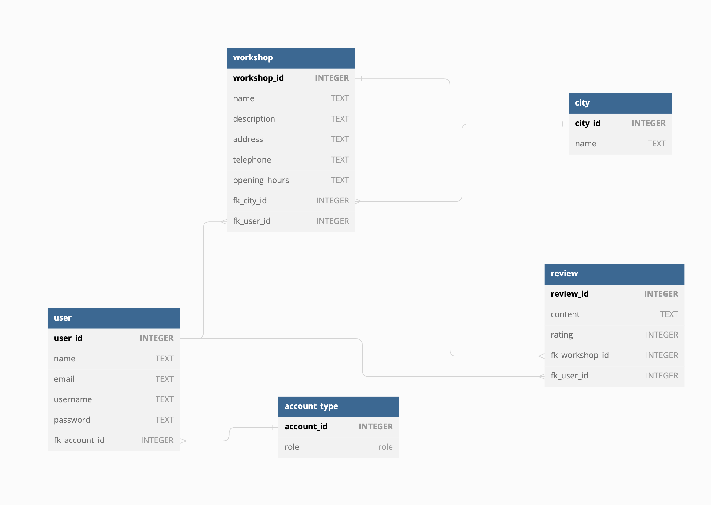

# CAR MECHANIC REVIEW SITE

A group assignment in "API-Utveckling" at Medieinstitutet.

## ABOUT

This is a review application for car mechanics that uses a SQL REST-API. It is designed for both users to handle reviews and their account and for workshop owners to update their information about their store and keep track on their reviews. To ensure security and privacy the application includes both authentication and authorization features as well as error handling and validation.

### SQL DATABASE

### BUILT WITH

- Javascript
- NodeJs
- ExpressJs
- SQLite

## THE TEAM

MAX KARLSSON

- [Github](https://github.com/maxtkarlsson)
- [LinkedIn](https://www.linkedin.com/in/max-karlsson-5307b1a3/)

MIRA VITSAS

- [Github](https://github.com/miravit)
- [LinkedIn](https://www.linkedin.com/in/miravitsas/)

## GETTING STARTED

1.  Clone this repo and open in a code editor

        git clone https://github.com/Malinaahlin/API-group-assignent.git

2.  install

    npm i

3.  run in terminal

    npm run seedDb

    npm run dev

4.  Create a .env-file and add

    PORT = 3000

    JWT_SECRET = (your jwt secret)

## LOGINS FOR TESTING

(ADMIN)

email: admin@admin.com

password: admin123

(USERS)

email: user@user.com

password: user123

email: user2@user2.com

password: user123

email: user3@user3.com

password: user123
